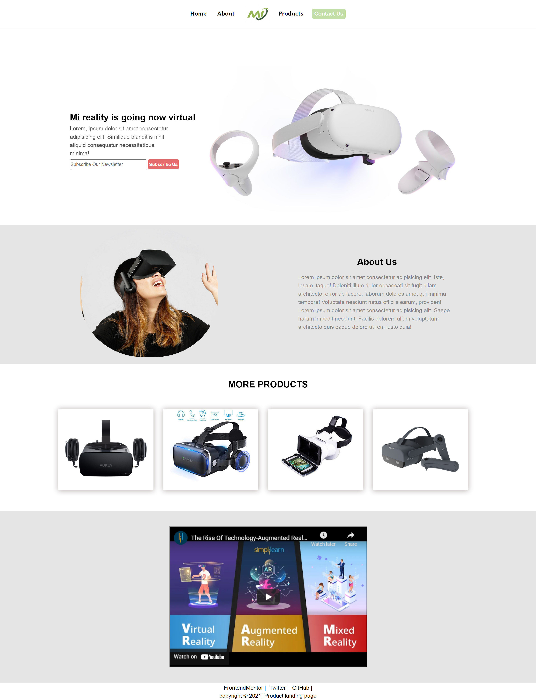

# Product Landind page

## Successfully passed tests ✅

### User Story 1: 
- My product landing page should have a header element with a corresponding <code>id="header"</code>.

### User Story 2: 
- I can see an image within the header element with a corresponding <code>id="header-img"</code>. A company logo would make a good image here.

### User Story 3: 
- Within the <code>#header</code> element I can see a nav element with a corresponding <code>id="nav-bar"</code>.

### User Story 4: 
- I can see at least three clickable elements inside the nav element, each with the class nav-link.

### User Story 5: 
- When I click a <code>.nav-link</code> button in the nav element, I am taken to the corresponding section of the landing page.

### User Story 6: 
- I can watch an embedded product video with <code>id="video"</code>.

### User Story 7: 
- My landing page has a form element with a corresponding <code>id="form"</code>.

### User Story 8: 
- Within the form, there is an input field with <code>id="email"</code> where I can enter an email address.

### User Story 9: 
- The <code>#email</code> input field should have placeholder text to let the user know what the field is for.

### User Story 10: 
- The <code>#email</code> input field uses HTML5 validation to confirm that the entered text is an email address.

### User Story 11: 
- Within the form, there is a submit input with a corresponding <code>id="submit"</code>.

### User Story 12: 
- When I click the #submit element, the email is submitted to a static page (use this mock URL: <pre>https://www.freecodecamp.com/email-submit</pre>

### User Story 13: 
- The navbar should always be at the top of the viewport.

### User Story 14: 
- My product landing page should have at least one media query.

### User Story 15: 
- My product landing page should utilize CSS flexbox at least once.
